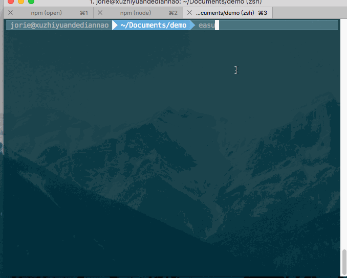

# easy-customize-cli

- Easy-cli can help you quickly build your own scaffolding (cli), add, delete, check and other functions.

## example

 > add github template:

   

  > init:

  

  > edit:

  

  > delete:

  